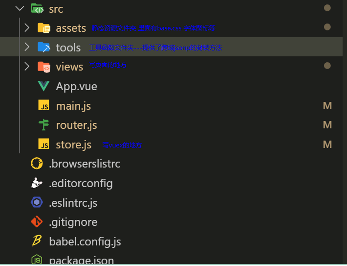
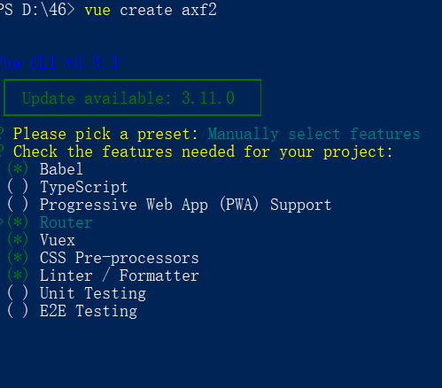
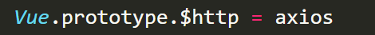

# vue 移动端项目实训文档

## 项目技术栈和实训目的
- 1 vue+vuex+vue-router+vant-ui+stylus

- 2 市面上vuepc端 UI框架主要有 element-ui/iview等 移动端主要有Mint UI/vux/Vant/Cube UI/NutUI/ant design vue等 快速上手不同的UI框架，学会自己找文档解决问题是非常迫切的

- 3 vuex入门 项目基础脚手架,路由,打包优化的再一次复习

## 如何运行示例代码

- 1 开启数据接口服务器（进入bee_quick目录）：`node app.js`

- 2 开启脚手架（进入axf2目录）：`npm run serve` 

## 实例代码文件夹目录说明

##  如何开始自己的项目

- 1.利用vue-cli初始化一个项目

- 2  选择如下的配置

- 3.配置路由什么的就不细说了

- 5.使用Jsonp跨域 文件在tools里

## 项目接口说明
  - 接口一 ：list组件中 左侧导航菜单的接口
  - 接口地址：`http://localhost:3008/list`
  - 使用说明：需要通过 JSONP 方式来*跨域*获取数据
  - 对应页面具体位置 

## vant-ui介绍
- 1 轻量、可靠的移动端 Vue 组件库

- 2 官网https://youzan.github.io/vant/#/zh-CN/intro

